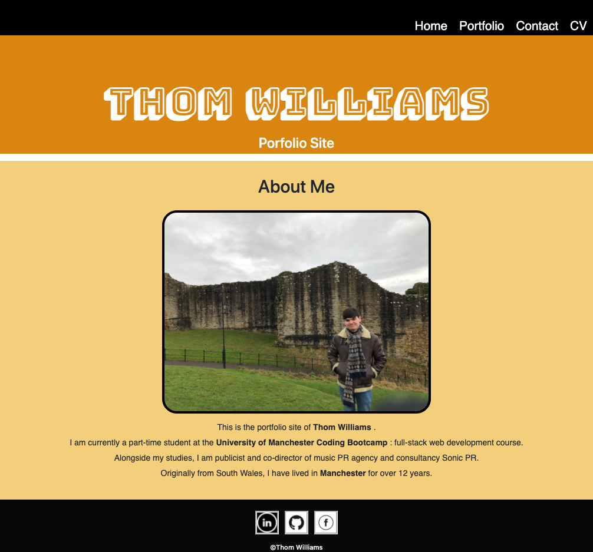
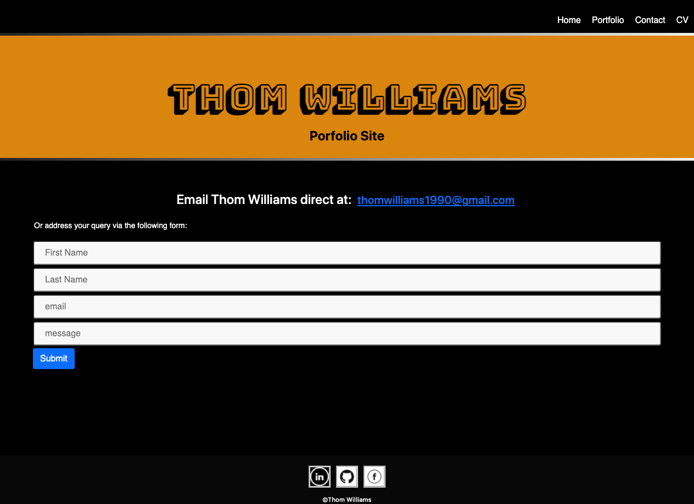
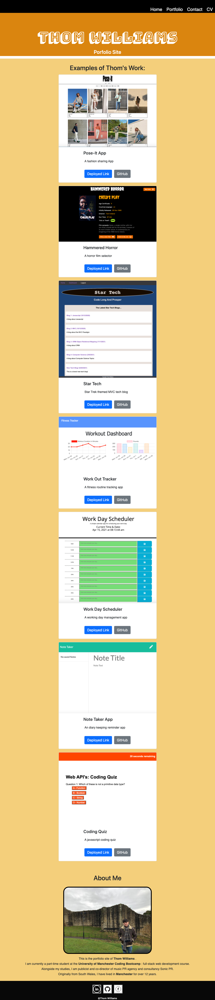
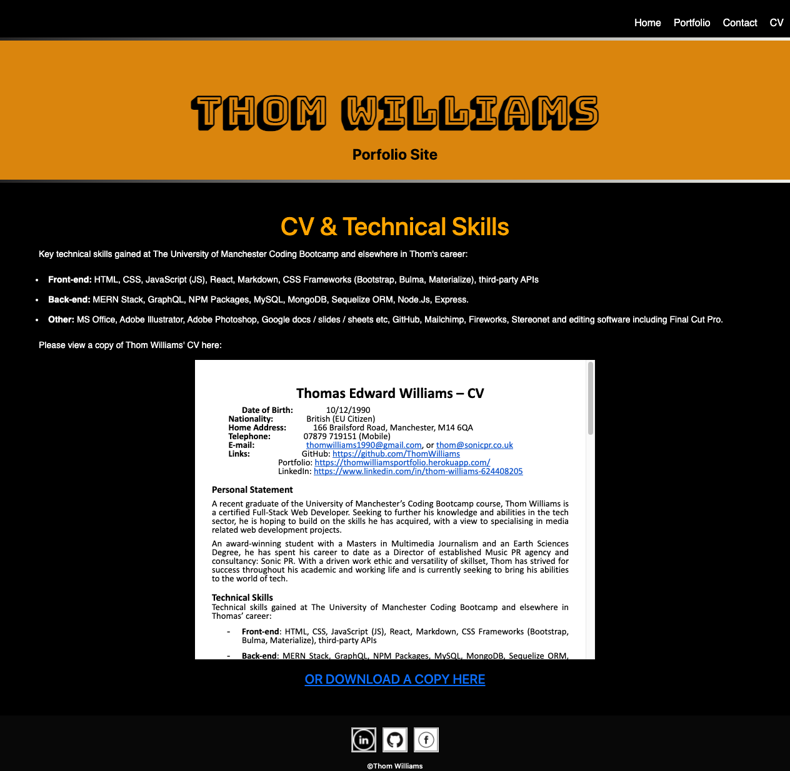

# Homework 20: React Portfolio

## Table of Contents

- [Description](#description)
- [Installation](#installation)
- [Usage](#usage)
- [Contributing](#contributing)
- [Tests](#tests)
- [Questions](#questions)
- [License](#license)

## Description

A portfolio for the web development projects of Thom Williams. 

Built with REACT, the portfolio has a homepage, a contact from page, CV and a portfolio of a number of Thom's projects to date. 

The app has a customised header with navigation bar, a section for various content, and a footer.

The about me section features bio details about Thom and a recent image. 

The footer features various socials links to Facebook, Linked-In and GithUb. 

The portfolio section features 6+ recent projects. Each dyanmically rendered project has its title, a brief description, an image, and links to the deployed app and Github repo.

The contact form is coded with email validation and information checks to ensure all fields are completed by the user before submitting. 

The CV page finds Thom's current CV hosted and 

The REACT built front-end is enhanced by HTML, Javascript and CSS. 

It has been deployed on GitHub Pages.

Screenshots of the app are also included below.

## Installation

The app works in any browser at the deployed link below.

However, to install the project please clone the repo from GitHub and use the following package manager:

- enter 'npm init' and 'npm i' in the terminal to install all packages.

- Or please ensure all dependencies and dev dependencies are installed (npm install {package}).

## Usage

Download, install NPM packages, enter npm run start / node server.js / nodemon server.js to activate server on Port 3000 and run the app.

## Contributing

To contribute further on this project please contacts the repo owners at the GitHub account below. 

## Tests

Further testing with jest package proposed for future development.

## Questions

For any further questions, please contact GitHub user:
[Thom Williams](https://www.github.com/ThomWilliams/)

Or for direct enquiries please email the follower developer address:
thomwilliams1990@gmail.com

## Screenshots

## Deployment / Links

- Github Pages: [GitHub Pages](https://thomwilliams.github.io/react-portfolio-tew/)

- Project Repository: [GitHub](https://github.com/ThomWilliams/react-portfolio-tew)

- Issue tracker: [GitHub Issues](https://github.com/ThomWilliams/react-portfolio-tew/issues)

## License

MIT

Copyright (c) [2021] [Budget-Tracker]

Permission is hereby granted, free of charge, to any person obtaining a copy
of this software and associated documentation files (the "Software"), to deal
in the Software without restriction, including without limitation the rights
to use, copy, modify, merge, publish, distribute, sublicense, and/or sell
copies of the Software, and to permit persons to whom the Software is
furnished to do so, subject to the following conditions:

The above copyright notice and this permission notice shall be included in all
copies or substantial portions of the Software.

THE SOFTWARE IS PROVIDED "AS IS", WITHOUT WARRANTY OF ANY KIND, EXPRESS OR
IMPLIED, INCLUDING BUT NOT LIMITED TO THE WARRANTIES OF MERCHANTABILITY,
FITNESS FOR A PARTICULAR PURPOSE AND NONINFRINGEMENT. IN NO EVENT SHALL THE
AUTHORS OR COPYRIGHT HOLDERS BE LIABLE FOR ANY CLAIM, DAMAGES OR OTHER
LIABILITY, WHETHER IN AN ACTION OF CONTRACT, TORT OR OTHERWISE, ARISING FROM,
OUT OF OR IN CONNECTION WITH THE SOFTWARE OR THE USE OR OTHER DEALINGS IN THE
SOFTWARE.
